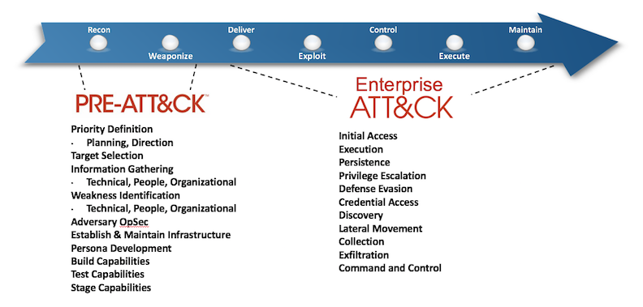

# 📜 Day 12: Payload Generation & Delivery IRL

### ⏱ Agenda

1. [🏆 [5m] Learning Objectives](#%f0%9f%8f%86-5m-learning-objectives)
2. [📖 [30m] Overview](#%f0%9f%93%96-30m-overview)
3. [💻 Activity: Hack the Box! 🔪](#%f0%9f%92%bb-activity-hack-the-box-%f0%9f%94%aa)

## 🏆 [5m] Learning Objectives

By the end of this lesson, you should be able to...

1. Identify all parts of a basic attack, including payload and method for payload delivery
2. Navigate and aim Metasploit
3. Be able to create your own payloads and deploy payload delivery methods with Metasploit and MSFVenom

## 📖 [30m] Overview

We've learned about building payloads that do all sorts of things once on another persons computer, and we've even already learned a **payload delivery method**, social engineering.  However, this is extremely risky and involves physically being at the site.  Today's lesson introduces **Metasploit**, a framework for both the exploitation of known vulnerabilities and the creation of new exploits themselves.

### Parts of an Attack

So what are the ways both professionals and real world hackers get from point A to B?  Well the best hackers are the ones that don't get caught so we don't really know about them, but real auditors, or **pen-testers**, tend to follow some steps when trying to gain access to a system.

(all the steps explained below with some other stuff we don't need to worry about now)

Typically, we follow some general steps before an attack:

1. **Planning**- General direction (wifi, network, bluetooth, phishing), known entrypoints to try, and what's needed in terms of time, software, and hardware.

2. **Target Selection**- What is the least secure attack surface?  What does your attack need to accomplish?  Will this target be monitored closely?

3. **Information Gathering**- What do we already know, what can we gather from recon technology, what can we assume

4. **Testing/Staging**- This is where you experiment with the information gathered.  Important to note is that you should make efforts to be less obvious, or be more "quiet", during this step just like the actual attack.  Testing funny URLs and form inputs can set off programatic and pattern-based defense software.

If we are able to find a viable **attack vector**, or way to gain entry into our target, we can launch an attack.  Attacks consist of these steps by nature:

1. **Access**- fairly self explanatory, using the vector from the testing/staging phase to gain access

1. **Payload Execution**- once we gain access, it's time for the fireworks.  A payload can be a script, command, or anything that accomplishes what you wanted to do on the host machine

1. **Post-Breach**- We can wrap the rest into post-breach, which is **persistence** (maintaining access to the target) and **digital anti-forensics** (covering our tracks).  From here it depends on what you want to accomplish.

Each system has it's own unique security considerations, attack surfaces to fortify, and weak points.  Whether you're attacking or defending, you'll want to consider these with any system in question.  Luckily, theres some software to help us get a better understanding of our system.

### Nmap

**Nmap** (short for "Network Map") is an open-source network scanner that gathers information by sending out packets and analyzing the responses.

It's highly recommended you install this to get a better sense of the information available on a network as well as your own fun scanning purposes.  Great for the "pre-attack" phase.

The website is [here](https://nmap.org/) where you can find docs and a manual install, but you can also `brew install nmap` (probably the best for Mac).

If you want to test it out, open a terminal:

`ipconfig getifaddr en0` - your very own network device's IP address

and then tell Nmap to scan it

`nmap -v -A <ipaddress>`

This is the simplest use case for Nmap, but it's capable of a lot.  Check out the website for everything it can do.

### Metasploit

**Metasploit** by Rapid7 was built for **penetration testing**, or white hat hacking for the sake of finding vulnerabilities before bad actors do. Metasploit comes with software for information gathering, payload delivery, and a CLI payload generator **MSFVenom**.  It also has both preloaded known vulnerabilities and the capability to deliver both those preloads and your very own 0 day exploits.

The best way to learn Metasploit is to play around with it. Metasploit is basically a collection of modules, and tools (for abusing known exploits) you'll navigate through using the CLI tool **MSFConsole**, and `options` that you can set to keep common information, like the target's IP and the number of background threads being used by the modules.

Before we install it, here are some basic commands to keep in mind.

!!! IMPORTANT - MSFConsole wraps the command line and parses only the commands it recognizes.  Using terminal commands like `ls` and `cd` will behave as if you're not in the MSFConsole.

You'll also see `RHOSTS`, `LHOSTS` in the documentation.  Point the L options towards your address and the R options towards the target address.

* `back` - return to the main directory from any module you're in.

* `search <QUERY>` - search for a function, target operating system, or web technology.  Try it out with a query like "portscan".

* `use <MODULE LOCATION>` - enter the module and start using it.  Use the search command to find module locations.

* `set <OPTION> <VALUE>` - this is where you set the necessary target and system variables, called `options`.  At the very least, you need to target an address using `set RHOSTS <ADDRESS>`.  Notice RHOSTS is plural, as you can target multiple addresses at once.

*  `run` - run the current module with the current options.

* `exit` - exit the MSFConsole

This should be all it takes to use the primary functionality of Metasploit.

### Installing Metasploit

Installation on MacOs is a little weird because it's not built to be run on this system.  We'll need to first enable the root user on our Mac as we'll be operating outside of our user directory and we'll root permissions, but Metasploit can't be `sudo`'d due to how it's build.

You can find the official apple instructions to do enable the root user on MacOs [here](https://support.apple.com/en-us/HT204012).

Now that we have that set up, lets install metasploit. [This](http://osx.metasploit.com/metasploitframework-latest.pkg) is the rolling latest version link for Mac.  Open the installer and follow the instructions.

Assuming your terminal profile starts from your user directory, you'll need to back out and navigate to `../../opt/metasploit-framework/msfconsole` to start the MSFC.  After you use the root user we enabled earlier with the command `su root`, Metasploit should now be at your fingertips.  Give it a whirl with the commands from earlier!

### MSFVenom and Meterpreter

**MSFVenom** is a custom payload generator that comes with Metasploit.  It has some ugly syntax, so the best way to learn it is probably to use a [cheatsheet](https://nitesculucian.github.io/2018/07/24/msfvenom-cheat-sheet/) and replace the options.

**Meterpreter** is a set of advanced pre-built payloads made to be built off of.  They use some crazy stuff called DDL in-memory injection to proliferate quietly, which goes outside the scope of this class.  You can find these payload locations with `search payload` or `search meterpreter`.

Venom will output a malicious file that acts based on the payload.  Used in conjunction with a prebuilt Meterpreter payload, you can create quiet the payload.

Generally, Metasploit suite is well known, and therefore well defended against because systems can track certain red-flag code (called code signature) and behavior.  While it is updated constantly, you'll need to also pair it with things like [Veil](https://github.com/Veil-Framework/Veil) to stand a chance against modern systems.

## 💻 Activity: Hack the Box! 🔪

So we have this cool software, and nothing to ~~legally~~ use it on.  Lucky the same people who made Metasploit knew about this problem and thus **Metasploitable** was born.  **Metasploitable** is a **virtual machine** (mini operating system) that can be run on your computer and used as a practice target for Metasploit.  It has been intentionally left vulnerable to many of the modules and known exploits that Metasploit can abuse.

Theres a lot of configuration, so the explanations will be brief.  If you want more, visit the [VirtualBox](https://www.virtualbox.org/wiki/Documentation) and [Metasploitable](https://metasploit.help.rapid7.com/docs/metasploitable-2) doc sites.

[VirtualBox](https://www.virtualbox.org/wiki/Downloads) - Virtual machine platform, which will build a separate computer from the Metasploitable image

[Metasploitable](https://information.rapid7.com/download-metasploitable-2017-thanks.html) - The vulnerable image you'll need to download

Run the VirtualBox installer.  It'll fail the first time, but will enable you to allow it in `control panel` > `security & privacy`.  If you don't get this message, delete VBox from your applications and rerun the installer, and go back to the control panel to allow it.

Once you have the Metasploitable image, go to VirtualBox.  Click the `New` button, go to expert settings, and fill out the form with the following.  Leave all settings not mentioned default.

* **Name**: metasploitable
* **Type**: Linux
* **Version**: Ubuntu (64 bit)
* **Memory Size**: 4096MB

When you get to `Hard Disk`, click the `use an existing virtual hard disk file` and navigate to the Metasploitable download (probably in downloads).  Inside the folder, select `Metasploitable.vmdk`.  Click `create` at the bottom.

Before we get into the fun, we have to contain ourselves a bit.  It's important to make sure you don't send anything spooky into the network, so we'll do that by stopping the target machine from possibly executing our payloads on the network.

Go to the new Metasploitable machine in the VBox manager screen (home screen) and click on the `network` header.  Set the `Attached to` option to `host-only`.  Let's also make it accept all connections by going to `advanced` and setting `promiscous mode` to `allow all`.

Start the machine and log in with the username and password `msfadmin`. Type `ifconfig`, look under the `eth0` interface (the virtual machine's network adapter) and set RHOSTS in Metasploit to the IP after `inet addr`.  Happy Hacking!

Stretch Challenge: Deliver a custom payload made with MSFVenom.
